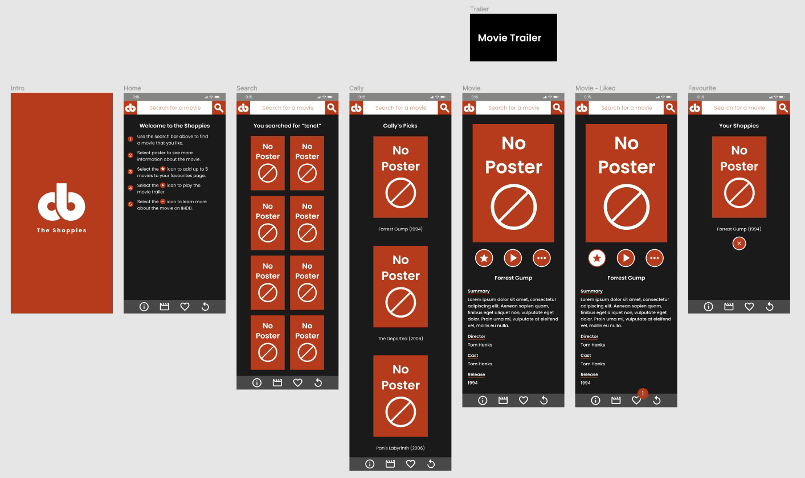

# The Shoppies

This project is designed as part of Shopify's Web Developer Intern Challenge - Fall 2021.

## The Challenge

Design a webpage that can search OMDB for movies, and allow the user to save their favourite films they feel should be up for nomination. When they've selected 5 nominees they should be notified they're finished. The parameters include:

<ul>
  <li>Search <a href="https://www.omdbapi.com/">OMDB API</a> and display the results (movies only)</li>
  <li>Add a movie from the search results to our nomination list</li>
  <li>View the list of films already nominated</li>
  <li>Remove a nominee from the nomination list</li>
</ul>

## Project

### Live Link

<a href="https://callyhobbes.github.io/the-shoppies/">Cally's Shoppies</a>

### Tech Used

<ul>
  <li><strong>Focus</strong>: Mobile First</li>
  <li><strong>Prototyping</strong>: Figma</li>
  <li><strong>Libraries</strong>: React, Redux </li>
  <li><strong>Compilers</strong>: SCSS</li>
  <li><strong>API</strong>: <a href="https://www.omdbapi.com/">OMDB API</a></li>
  <li><strong>Database</strong>: Firebase</li>
</ul>

### Prototype

 
<a href="https://www.figma.com/proto/JLumAHGPPzvFxoSTiMVMhd/The-Shoppies?node-id=1%3A28&scaling=scale-down&page-id=0%3A1" align="center">Prototype</a>
 
The application was designed in Figma as a mobile-first experience. I created a copy of components and interactions to get feedback regarding the UI/UX.

### Walkthrough

 

<ol>
  <li>Use the search bar above to find a movie that you like.</li>
  <li>Click on the poster images to see more information about the selected title.</li>
  <li>Select the star icon to add up to 5 movies to your favourites page.</li>
  <li>Select the play icon to play the movie trailer.</li>
  <li>Select the three dots icon to learn more about the movie on IMBD.</li>
  <li>Use the navbar to see your favourites (heart icon), your past search (rewind icon) or to see Cally's picks (movie icon).</li>
</ol>

### Comments

I had a ton of fun building this application. I wanted to use a mixture of React class and function components to see how they would interact with redux. After using a mixture of both, I would have to say I prefer using hooks with redux than with class components. However, I do feel they are both beneficial. I decided to store my favourite movies in a firebase database that people could see and also add to their list.

I decided to name the nominations as "favourites", because while they are nominations, it is more of a collection of our favourite movies. 

I'm pretty happy with the error handling in the project. It took awhile but glad that it catches most issues.

Happy Shoppies!

### Future

<ul>
  <li>I'd probably change the App class component to a function to use useEffect for the search results.</li>
  <li>Set-up a database for the user's favourites or have tally of all the users submissions.</li>
  <li>There is always more time for some styling.</li>
</ul>

